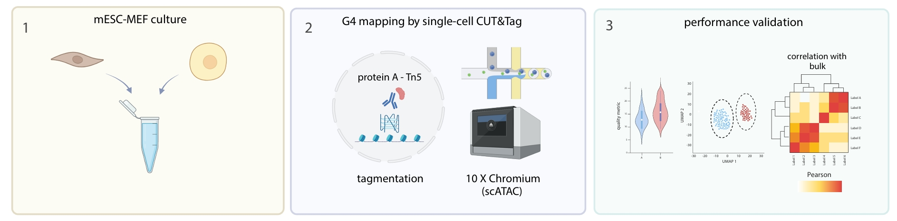
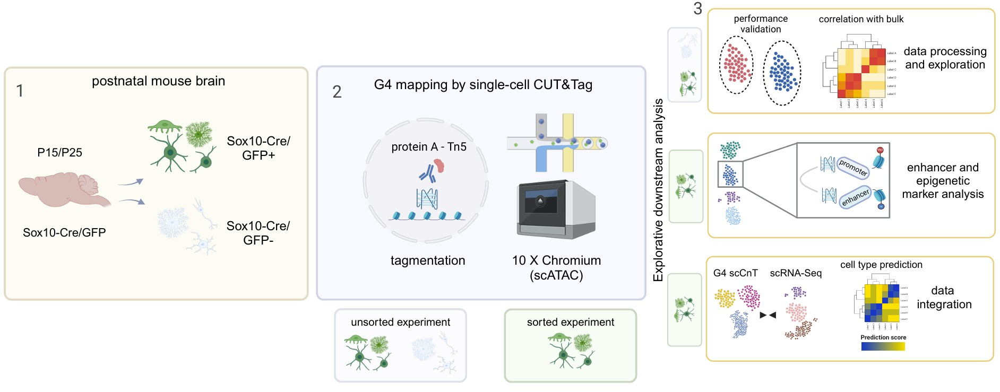

# G-quadruplex Profiling in Complex Tissues Using Single-cell CUT&Tag

This repository contains the main scripts for the manuscript "G-quadruplex Profiling in Complex Tissues Using Single-cell CUT&Tag" as well as the processed Seurat objects used in the analysis.
Main Steps Include:

* Seurat processing of G4 scCUT&Tag data
* Exploratory analysis and performance validation
* Integration with scRNA-Seq data (Bartosovic et al.)
* Differential G4 analysis
* Cicero exploration

Repository Structure

* _scripts/data_processing/:_ Contains R scripts for processing raw data (CellRanger output).
* _scripts/data_integration/:_ Includes workflows for data integration using Seurat or scBridge.
* _scripts/evaluation/:_ Contains scripts for exploratory analysis and downstream steps.
* _utils/_: Provides helper functions used during the analysis.

## Workflow:

mESC-MEF G4 scCUT&Tag schematic workflow: 

mESC-MEF Seurat objects: 
- _results/Seurat/mESC_MEF/outputs/Seurat_object.Rds_

postnatal mouse brain G4 scCUT&Tag schematic workflow: 

unsorted Seurat objects: 
- _results/Seurat/unsorted_mousebrain/res0.1/outputs/Seurat_object.Rds_
- _results/Seurat/unsorted_mousebrain/res0.8/outputs/Seurat_object.Rds_

GFP sorted Seurat object:
- _results/Seurat/GFP_sorted_mousebrain/res0.8/outputs/Seurat_object.Rds_

### scBridge integration

scBridge is a neural network driven single-cell multi-omics data integration tool taking advantages of the existing data heterogeneity ([_Yunfan Li et al., 2023_](https://www.nature.com/articles/s41467-023-41795-5))

Installation: [scBridge github](https://github.com/XLearning-SCU/scBridge)

Note: scBridge runs on a single GPU.

1. _create_h5ad.py_ - Create h5ad format from gene activity scores and scRNA-Seq counts
2. _scbridge.sh_ - Run on cluster with GPU
3. _scbridge_outputs.py_ - Visualization

# Data

GEO repository:
